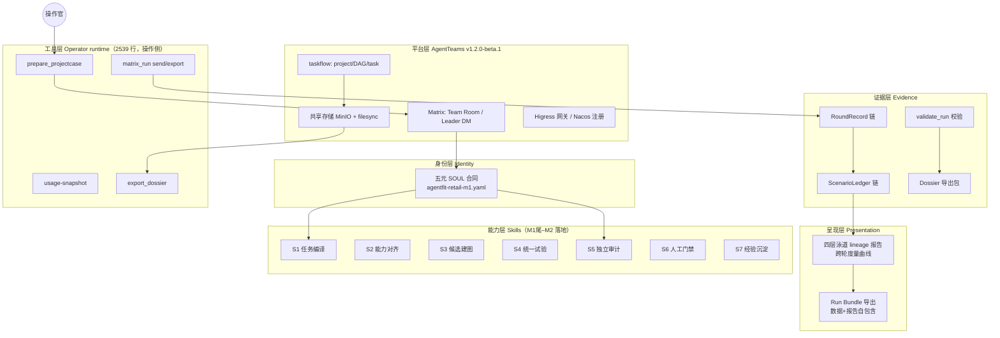
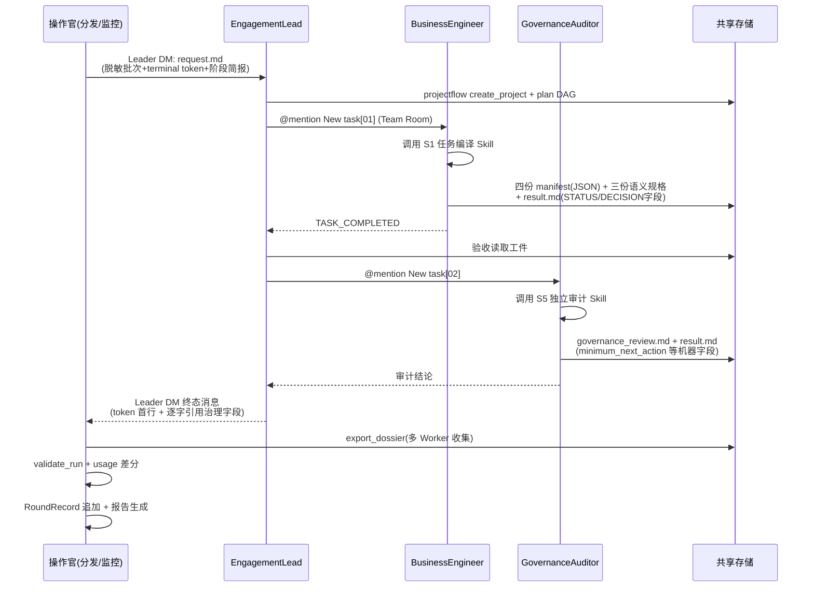
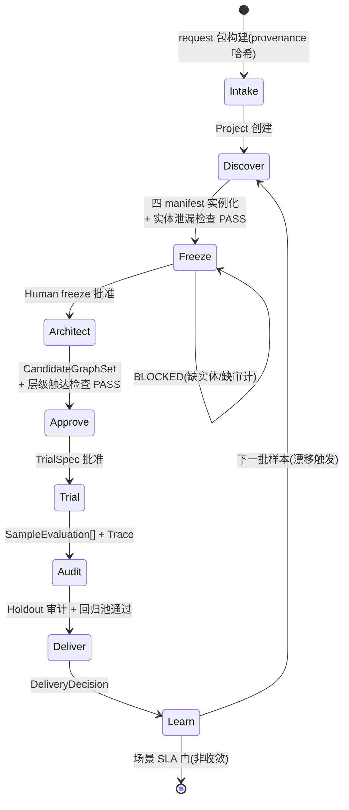
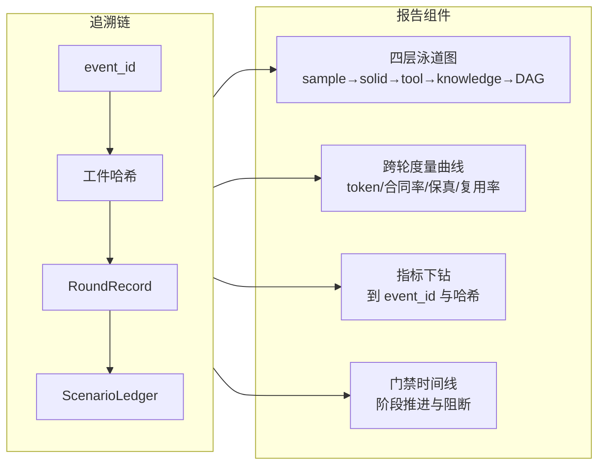

# AgentFit 实现蓝图

> 文档地位：实现层唯一基线。语义与纪律以 [AgentFit 整体方案](agentfit-solution.md)（v4）为准；本文档定义它的代码结构、Skill 结构、数据结构与产物管线。执行每一轮运行即是对本蓝图逐组件的验收。
>
> 版本：v1（2026-08-15，基于 R1–R4 四轮真实运行的经验与教训收敛）

## 0. 设计原则

1. **代码执政**：凡可由 schema/checker/状态机拒绝的，不依赖 prompt 自觉；
2. **产物即接口**：组件间只通过本蓝图注册的中间产物通信，每个产物有 schema、生产者、消费者与内容哈希；
3. **训练日志级导出**：任何一轮运行可导出为自包含 bundle（结构化数据 + 可视化报告），断链即不可审计；
4. **最小充分**：不引入蓝图之外的系统；平台缺陷只记录不吸收。

## 1. 总体架构



要点：能力层是当前最大空白（R4 实证：GA 与 BE 在任务现场即兴手写 `verify_hashes.py` / `compute_hashes.py`——Skill 未落地时 Agent 会自己造工具）。Skill 层的种子代码就来自这些被实战验证过的即兴产物。

## 2. 任务流转（一轮运行的完整管线）



与现状的差异（蓝图生效后）：工件为 JSON（不再是自由 .md）；导出从多 Worker 本地收集（不依赖 filesync 镜像）；治理字段机器比对（保真不再靠人眼）。

## 3. 生命周期状态机（代码强制，取代口头门禁）



非法迁移（如 Freeze 未批先进 Architect、holdout 泄漏、回归退化）由 `lifecycle.py` 直接拒绝——这是 M2 的核心交付物。

## 4. Skill 体系（能力层）

每个 Skill 是一个可安装包，发布到 Worker 的 skills 目录，Agent 调用而非现场造轮子：

```
skills/
├── s1-task-compile/        # 种子: BE 的 compute_hashes.py(R4)
│   ├── SKILL.md            # 触发条件、IO 契约、失败处理
│   ├── compute_hashes.py   # manifest 内容哈希(确定性)
│   └── schema/manifest.schema.json
├── s2-capability-align/    # 接口缺口/复用率核算
├── s3-candidate-graph/     # 四层建图(layer 标签+触达校验)
├── s4-unified-trial/       # Episode 执行+分层 Trace 采集
├── s5-independent-audit/   # 种子: GA 的 verify_hashes.py(R4)
│   ├── SKILL.md
│   ├── verify_hashes.py    # 哈希独立复算
│   └── check_entity_leak.py# 实体跨 split 检查
├── s6-human-gate/          # 审批记录/拒绝/超时/回滚模板
└── s7-asset-consolidation/ # RegressionPool 回归+资产版本化
```

原则：Skill 只含**确定性代码与 schema**，判断类步骤仍在 Agent（SOUL 定义何时调用）；Skill 的每次调用记入 Trace（输入哈希、版本、输出哈希）。

## 5. 中间产物注册表（产物即接口）

| 产物 | 格式 | 生产者 | 消费者 | 存储 |
|---|---|---|---|---|
| `request.md` + `provenance.json` | md + json | prepare_projectcase | Leader / validator | run 目录(0600) |
| `samples.json`（脱敏批次） | json | prepare | 团队 / 回放 | run 目录 |
| `send.json`（token/event 锚点） | json | matrix_run | collector / validator | run 目录 |
| `conversation.raw/normalized.json` | json | export-once | validator / 报告 | run 目录 |
| 四份 `sample-set-manifest.*.json` | json(B1) | BE via S1 | GA / validator / freeze | task 目录+导出包 |
| `governance_review.md` + `result.md` | md+机器字段 | GA via S5 | Leader / validator | task 目录+导出包 |
| `export-manifest.json`（全文件哈希） | json | export_dossier | validator | dossier 目录 |
| `usage-before/after.json` | json | usage-snapshot | 成本核算 | run 目录 |
| `RoundRecord` | json | 操作官工具 | ScenarioLedger / 报告 | ledger 链 |
| `ScenarioLedger` | json(哈希链) | 操作官工具 | 审计 / 报告 | ledger 链 |
| Run Bundle | json+html | 报告生成器 | 人 / 评审 | 可导出 |

**RoundRecord 结构**（AgentFit 版训练日志条目）：

```json
{
  "round_id": "retail-home-r4-...",
  "prev_record_sha256": "...",
  "lifecycle_position": "Discover→Freeze",
  "input_refs": {"manifest_sha256": "...", "candidate_version": null},
  "metrics": {"events": 70, "tokens": 9773683, "artifact_contract_rate": 1.0,
               "delegation_correct": true, "governance_fidelity": true,
               "terminal_discipline": true},
  "findings": [{"side": "agent|contract|tool|platform", "note": "...", "evidence": "event_id/工件哈希"}],
  "design_changes": [{"file": "...", "diff_ref": "git", "evidence": "..."}]
}
```

## 6. 可追溯与可视化



- **形态**：自包含单文件 HTML（无外部依赖、无服务端），作为 Dossier 工件导出——不是产品 UI；
- **导出训练结果** = Run Bundle：`round-records.json`（机器可读全链）+ `report.html`（人读）+ 哈希清单；评审可在离线环境完整复核；
- 数据源全部来自第 5 节注册表——报告不引入新的真实源。

## 7. 分阶段落地

| 阶段 | 交付 | 验收 |
|---|---|---|
| M1 尾 | S1/S5 Skill 包（种子收编 R4 即兴产物）；manifest JSON schema；导出器多 Worker 收集 | R5：Agent 调用 Skill 产出 JSON 工件，dossier 导出 PASS |
| M2 | `lifecycle.py` 状态机；checker 族（层级/泄漏/保真/schema）；RoundRecord→ScenarioLedger；报告生成器 v1（泳道+曲线） | 非法迁移被机器拒绝；R6 报告自动生成；bundle 导出可离线复核 |
| M3 | S2/S3/S4/S6 补齐；对照即回归；报告 v2（下钻） | 三类候选统一对照 + 回归池通过率曲线 |
| M4 | S7；干净环境复现；报告为比赛证据包 | 独立复现同结论 |

## 8. 与既有资产的关系

- `runtime/agentteams/**`（工具层）全部保留，按本蓝图演进（export_dossier 改多 Worker 收集）；
- `docs/agentfit-solution.md` v4 不变——本蓝图是其实现投影；
- 提交材料不受本蓝图影响（实现属复赛工程证据）；
- R4 的即兴脚本（`verify_hashes.py`/`compute_hashes.py`）在征得确认后收编为 S5/S1 种子。

历史版本经 Git 追溯；本文档的变更即实现基线变更，需与整体方案同步评审。
